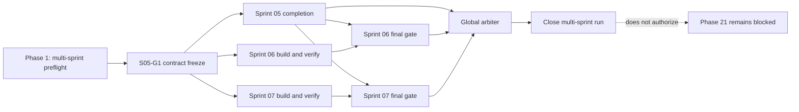

# NEWS OS Sprint 05-07 Multi-Sprint Orchestration

## Overview

Prepare one NEWS OS Master to coordinate Sprint 05, 06 and 07 as a staggered
multi-sprint run. Sprint 05 starts first. Its contract-freeze gate unlocks
parallel Sprint 06 and Sprint 07 work while Sprint 05 finishes. This plan does
not dispatch workers, acquire a lease, commit changes or start Phase 21.

## Scope

- In: worker/capability preflight, three sprint backlogs, ownership matrix,
  dependency gates, token-free observation, receipts, promotion and arbiters.
- Out: custom scheduler/worker lifecycle, Herdr execution authority, local
  PostgreSQL, Community Gateway work, Sprint 08+, Phase 21 and product coding by
  the Master.
- Existing authority: Orca executes; SQLite is local authority; Herdr may only
  observe/read/attach; the Master coordinates only.

## Execution strategy

Use nine logical lanes but no more physical writers than live OLC evaluation
proves. Five concurrent writers is a planning ceiling, not a guaranteed target.
The Master computes Global OLC, Effective Global OLC, Sprint OLC and per-Sprint
allocation from local resource pressure, weighted active workloads, verified
worker/quota/fallback capacity, ownership, dependencies and budget. Reserve an
independent review route when a sprint reaches a gate. A logical lane without a
physical slot keeps a prepared `NEXT` and starts as soon as weighted capacity
and a verified worker route are available.

1. **Wave A:** run Sprint 05 lanes until `S05-G1` freezes Home/Project SEN IDs,
   scope rules, digest schema and replaceable-session interface.
2. **Wave B:** continue Sprint 05; start Sprint 06 and Sprint 07 against the
   hash-pinned `S05-G1` contract. Sprint 06 and 07 may progress concurrently.
3. **Wave C:** close Sprint 05 first. Sprint 06 and Sprint 07 cannot emit final
   GO until Sprint 05 is GO and their current bytes pass independent review.
4. **Wave D:** promote each sprint independently, then run one global arbiter.
   A sprint failure reopens only its owned correction queue.

## Dependency graph



## Ownership matrix

| Owner | Exclusive implementation surface | Shared/read-only inputs | Forbidden writes |
|---|---|---|---|
| Sprint 05 | `go/internal/senidentity/**`, `src/lib/sen-scope/**`, `src/app/api/sen/home/**`, `src/app/api/sen/projects/**`, Sprint-05 fixtures/reports | localDB product interfaces, durable Chat, Orca IDs | Sprint-06/07 paths, existing shared schema after `S05-G1` |
| Sprint 06 | `go/internal/sprintcompiler/**`, `src/lib/run-kanban/**`, designated `src/lib/agent-kanban/**`, `src/app/api/sen/sprints/**`, designated Run APIs, Sprint-06 fixtures/reports | hash-pinned S05 contract, Orca adapter/projections | Sprint-05/07 paths; direct worker/process execution |
| Sprint 07 | `go/internal/maintainer/**`, `src/lib/maintainer/**`, `src/app/api/sen/maintenance/**`, Sprint-07 fixtures/reports | hash-pinned S05 contract, health/tool probes | Sprint-05/06 paths; community upload/escalation implementation |
| Integration owner | shared SQLite migration registration, shared exports/routes, promotion manifests and cross-sprint tests | accepted sprint receipts/current bytes | feature redesign; unreviewed producer edits |
| Master | queue/lease/state/report metadata only | all receipts, terminal deltas and gates | product code, lane-owned reports, Phase 21 |

No file may appear in two active writer allowlists. If scouting finds an overlap,
move that file to the integration owner and replace producer edits with a
versioned interface/fixture until Wave D.

## Worker and lane policy

| Sprint | Logical lane 1 | Logical lane 2 | Logical lane 3 | Exit dependency |
|---|---|---|---|---|
| 05 | preferences/project registry/digest UI | scoped conversation-memory-context | exactly-one SEN/privacy/continuity verification | `S05-G1`, then independent S05 GO |
| 06 | proposal/timebox/budget UX | goal slicer, allocator, workflow/loop editor | approved proposal to Orca Runs and Run-level review | S05 GO + independent S06 GO |
| 07 | tool/version/health/recipe surfaces | environment fingerprint/incidents/checkpoints | bounded repair/rollback/poisoning tests | S05 GO + independent S07 GO |

Every logical lane has `ACTIVE`, `NEXT` and `FALLBACK`. Fallback work is scoped
verification, fixture construction, contract review or blocker removal; it may
support another sprint only through read-only review or explicitly transferred
ownership. Provider selection and fallback are resolved from live preflight,
not copied from an older sprint. Current worker policy: the Claude route is
`claude-kimicode`; `claude-fugu` is retired and must not be selected. Lane-level
fallbacks remain subject to live capability/quota verification.

## Control and evidence contract

- One multi-sprint controller lease; state contains per-sprint substate and one
  generation-fenced owner. `newos-master:take-over` transfers the whole run.
- Token-free observer emits one compact line per sprint and a global total.
- Token-free OLC sampling records bounded host pressure, weighted active load,
  worker/quota/fallback health and available capacity. No project content,
  prompts, raw terminal output or credential material enters telemetry.
- Model/controller wakes only on state deltas: completion, idle-with-backlog,
  provider/fallback failure, context risk, resource-pressure threshold,
  OLC/allocation change, blocker, ownership collision or gate change.
- Each job ends with exact `JOB_DONE: <task-id>`, a bounded receipt and hashes of
  current artifacts. Terminal idle is not completion.
- Promotion follows writer freeze -> current-byte manifest -> independent
  mechanical gate -> arbiter verdict.
- Phase 21 remains blocked regardless of Sprint 05-07 verdicts.

Observer output contract:

```text
S05: L1 <done>/<total> | L2 <done>/<total> | L3 <done>/<total> || <done>/<total>
S06: L1 <done>/<total> | L2 <done>/<total> | L3 <done>/<total> || <done>/<total>
S07: L1 <done>/<total> | L2 <done>/<total> | L3 <done>/<total> || <done>/<total>
GLOBAL: <done>/<total> | active=<n> blocked=<n> review=<n>
```

## Pre-run review verdict

**CONDITIONAL GO for planning; NO-GO for dispatch yet.** Dispatch becomes legal
only after Phase 1 proves all of the following:

1. the selected Effective Global OLC is backed by safe live worker slots,
   weighted host capacity and a current concurrency/time estimate;
2. zero writer-path collisions in the generated ownership manifest;
3. one live controller lease and one independently routable arbiter;
4. prepared queue coverage for every logical lane; and
5. explicit Phase 21 block in controller and close-gate state.

## Phases

| # | Phase | Status | Dependency |
|---:|---|---|---|
| 1 | [Multi-sprint preflight and contract freeze](./phase-01-start.md) | Pending | Sprint 04 GO evidence |
| 2 | [Sprint 05 Home and Project SEN](./phase-02-sprint-05-home-project-sen.md) | Pending | Phase 1 |
| 3 | [Sprint 06 Sprint compiler and Run Kanban](./phase-03-sprint-06-sprint-compiler-run-kanban.md) | Pending | `S05-G1`; final GO waits Phase 2 |
| 4 | [Sprint 07 Home SEN maintainer](./phase-04-sprint-07-home-sen-maintainer.md) | Pending | `S05-G1`; final GO waits Phase 2 |
| 5 | [Global integration, arbiter and close](./phase-05-global-integration-arbiter-close.md) | Pending | Phases 2-4 |

## Success criteria

- [ ] Live preflight proves controller, worker, fallback and arbiter capacity.
- [ ] OLC evidence proves the selected physical concurrency fits current host
      pressure, workload weights, effective workers, budget and safe ready work.
- [ ] No active writer ownership overlaps; shared files have one integration owner.
- [ ] Sprint 06/07 start only after hash-pinned `S05-G1`.
- [ ] Sprint 05 closes before Sprint 06/07 final verdicts.
- [ ] Every accepted job has current-byte evidence and exact completion marker.
- [ ] Each sprint has an independent arbiter; global arbiter reports GO/NO-GO.
- [ ] Controller lease is released and detector disabled only after global close.
- [ ] Phase 21 remains explicitly blocked.

## Load-bearing assumptions

| Assumption | Break signal | Pre-decided response |
|---|---|---|
| Selected worker slots remain live | fewer routes pass capability/auth/write preflight than the current Effective Global OLC | reduce physical concurrency; preserve logical queues and re-estimate wall time |
| Current host can sustain the selected weighted load | CPU/memory/disk/thermal pressure or a heavy job pushes active load above Effective Global OLC | stop admissions; drain safest bounded work; lower allocation and re-estimate |
| Provider capacity remains effective | primary quota/auth fails and no verified fallback exists, or profiles share one exhausted quota pool | remove affected slots from Effective Global OLC; reallocate independent work or mark provider-blocked |
| `S05-G1` is sufficient for 06/07 compilation | either sprint requires an unfrozen identity/scope semantic | stop dependent jobs; revise and re-pin G1 once, then rebase fixtures |
| Ownership can remain disjoint | same file appears in two writer manifests | fence both edits; assign file to integration owner; redispatch scoped work |
| Independent arbiter route remains available | no verified C3/review route at close | keep sprint review-ready, not GO; retry only after route preflight changes |

## Sources

- `docs/orchestration-runbook.md`
- `docs/newsos-master-memory.md`
- `docs/optimal-lane-count.md`
- `C:/Users/ADMIN/Documents/Agent OS/plans/260804-0518-sen-news-os-implementation/sprint-execution-map.md`
- Sprint 02-04 close and arbiter reports under `plans/reports/`
