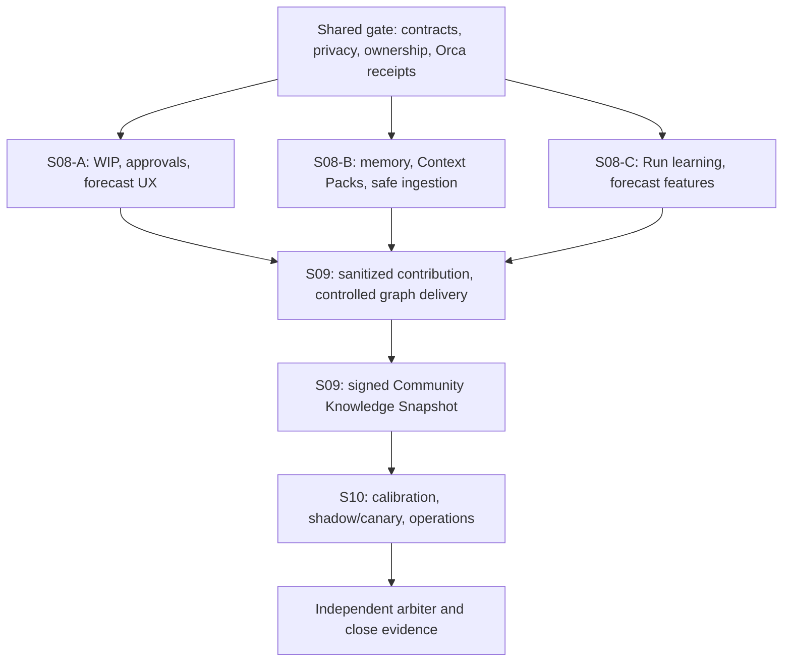

# NEWS OS next parallel sprints 08-10

## Overview

This plan continues after the verified Sprint 05-07 `GO`. It prepares Sprint 08-10 as a dependency-aware sequence: one shared contract gate; three isolated Sprint 08 foundation lanes; Sprint 09 community contribution, controlled graph delivery, and signed knowledge return; then Sprint 10 forecast calibration, evaluation, operations, and close evidence.

The product outcome is not merely that agents run in parallel. The owner governs architecture and user stories conversationally through SEN. SEN translates that intent into sequential work, a critical path, a useful lane range, and an elapsed-time forecast. A headline such as `100 sequential agent-hours -> 3-5 useful lanes -> 20-30 estimated elapsed hours` is valid only when dependencies, serial work, review/retry allowance, resource assumptions, cost range, confidence, and actual-versus-estimated evidence are visible.

The repository and Orca remain authoritative. MemoraX is advisory only. No worker dispatch, production cutover, legacy-writer reactivation, Sprint 05-07 rewrite, or Phase 21 start is authorized by this plan.

## Goals

| # | Goal | Priority |
|---|---|---|
| 1 | Freeze interfaces, privacy boundaries, ownership, and receipts before parallel work | P1 |
| 2 | Deliver admission/approval automation, forecast presentation, and memory/context foundations without shared-file collisions | P1 |
| 3 | Persist privacy-safe Run Learning Records and reproducible Forecast Feature Records | P1 |
| 4 | Deliver bounded community contribution, controlled parallel execution, and signed Community Knowledge Snapshots | P1 |
| 5 | Calibrate SEN estimation, critical-path planning, OLC/allocation, and builder/workflow selection | P1 |
| 6 | Prove evaluation, rollback, operations, and close gates | P1 |

## Phases

| # | Phase | Status |
|---|---|---|
| 1 | [Sprint 08 shared gate and parallel lane contracts](./phase-01-start.md) | Pending |
| 2 | [Sprint 08 parallel foundation lanes](./phase-02-sprint-08-shared-gate-and-parallel-lane-contracts.md) | Pending |
| 3 | [Sprint 09 community escalation and controlled delivery](./phase-03-sprint-08-parallel-foundation-lanes.md) | In progress |
| 4 | [Sprint 10 evaluation operations and close gate](./phase-04-sprint-09-community-escalation-and-controlled-delivery.md) | Pending |
| 5 | [Closeout and release-readiness evidence](./phase-05-sprint-10-evaluation-operations-and-close-gate.md) | Pending |

## Success criteria

- [ ] Shared gate freezes interfaces, forbidden fields, ownership, dependency ledger, and rollback boundaries. (OPEN: historical plan dir; see roadmap track record)
- [ ] All three Sprint 08 lanes pass focused tests and produce reproducible receipts. (OPEN: historical plan dir; see roadmap track record)
- [ ] Every terminal Run produces one immutable local learning record and one reproducible, content-free forecast feature record. (OPEN: historical plan dir; see roadmap track record)
- [ ] Sprint 09 proves consent, quarantine, provenance, bounded graph execution, merge safety, and signed knowledge-snapshot return. (OPEN: historical plan dir; see roadmap track record)
- [ ] Sprint 10 proves forecast calibration, out-of-distribution handling, shadow/canary, rollback, operational readiness, and independent arbitration. (OPEN: historical plan dir; see roadmap track record)
- [ ] SEN presents sequential work, critical path, useful lanes, elapsed-time interval, resources/cost, confidence, and actual-versus-estimated results without promising linear speedup. (OPEN: historical plan dir; see roadmap track record)
- [ ] Plan closes only with all required evidence recorded; no partial state is treated as complete. (OPEN: historical plan dir; see roadmap track record)

## Execution topology



Sprint 08-A, 08-B, and 08-C may run concurrently only after the shared gate is green and live OLC admits the physical slots. They must not edit the same producer files, migrations, fixtures, or generated artifacts. One integration owner serializes shared SQLite migration registration and public DTO exports. Sprint 09 starts only after all three receipts are accepted. Sprint 10 is sequential after Sprint 09 because it evaluates integrated behavior and consumes a signed knowledge snapshot.

## Ownership and constraints

| Lane | Owns | Does not own |
|---|---|---|
| Shared gate | Contract schemas, forbidden-field policy, dependency ledger, lane manifests, reports | Feature implementation |
| S08-A | Allocator/WIP/approval/scheduler, estimate proposal, forecast UX, tests | Memory, contribution routes, release flags |
| S08-B | Memory, Context Packs, indexing, safe ingestion, tests | Scheduler, contribution routes, release flags |
| S08-C | Run Learning Record, Forecast Feature Record, estimate-versus-actual, local Contribution Candidate derivation | Raw private export, scheduler authority, public gateway |
| Integration owner | Shared migration registry and frozen cross-lane DTO exports | Producer implementation and feature redesign |
| S09 | Consent, quarantine, contribution/escalation, graph integration, signed knowledge snapshots | Estimator promotion, final cutover |
| S10 | Calibration/evaluation registry, replay, shadow/canary, rollback, runbooks, close evidence | New product scope or direct execution authority |

Every lane reports through Orca with immutable receipts, current-byte verification, and an independent arbiter. Do not start Phase 21 or command-authority cutover until its separate gate is explicitly satisfied.

## Learning and forecast authority

```text
raw Run evidence in sen-product.db/local artifact store
  -> immutable Run Learning Record
  -> versioned Forecast Feature Record
  -> strict allowlist and idempotent Contribution Candidate
  -> community-queue.db
  -> Community Gateway validation/moderation/aggregation
  -> signed, versioned Community Knowledge Snapshot
  -> local SQLite
  -> SEN advisory estimation, OLC, allocation, and workflow selection
```

- Raw prompts, conversations, user-story content, source code, diffs, repository/project identity, paths, terminal output, secrets, credentials, and personal data never enter forecast contribution schemas.
- Live machine/provider state and the owner's local history outrank matched community priors. Aggregates expose task/configuration cohort, sample size, uncertainty, version/time window, and selection-bias limits.
- Learning remains advisory. It cannot launch workers, lower approval/review/privacy/capability/budget gates, or override Orca execution authority.
- Forecast quality is evaluated by elapsed-time and sequential-work error, prediction-interval coverage, lane-utilization error, retry/rework miss rate, acceptance calibration, and allocation regret.
- Sparse or mismatched evidence produces a wider interval or `low confidence / out of distribution`, never fabricated precision.

<!-- slug: news-os-next-parallel-sprints-08-10 -->
