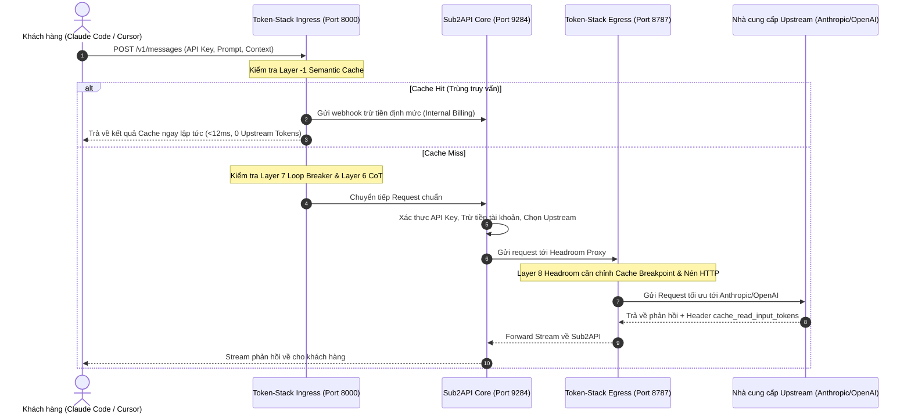

# Phase 1: Architecture & Proxy Topology Design

## 1. Mục tiêu
Thiết kế và triển khai cầu nối Proxy hai chiều (Dual-Bridge Proxy) giữa khách hàng, Token-Stack và Sub2API router:
- Khách hàng kết nối vào Gateway tại cổng chuẩn (ví dụ: `http://api.yourdomain.com/v1`).
- Gateway thực hiện xử lý Ingress (nhận diện cache, bảo vệ loop) trước khi chuyển vào Sub2API.
- Sub2API xác thực API Key của khách, kiểm tra số dư và chuyển tiếp sang Egress của Token-Stack để tối ưu hóa token trước khi gửi về Upstream.

## 2. Luồng Xử Lý Chi Tiết (Request/Response Pipeline)

## 3. Các File Cần Tạo / Chỉnh Sửa
- `gateway/ingress-proxy.cjs`: Reverse proxy Node.js / Bun siêu nhẹ chịu tải cao.
- `gateway/config.json`: Cấu hình định tuyến cổng, upstream Sub2API, và ngưỡng cache.
- `docker-compose.yml`: Khai báo dịch vụ Ingress, Sub2API, Redis, SQLite.

## 4. Kiểm Thử & Xác Thực
- Kiểm tra curl qua Ingress: `curl -X POST http://127.0.0.1:8000/v1/messages`
- Đo latency overhead: Phải nhỏ hơn 15ms cho các request thông thường.
